# @nocobase/plugin-custom-icons

> **NocoBase 自定义图标库与海量 SVG 扩展插件 (Custom Icons Plugin for NocoBase)**  
> 专为 NocoBase 打造的高性能、企业级自定义图标管理中心。不仅原生深度增强官方 `IconPicker` 图标选择器，提供一体化调色与字号配置能力，还内置海量精选开源图标库市场，支持阿里巴巴 Iconfont 在线合辑一键探测与批量导入，让您的 NocoBase 应用轻松拥有极致丰富、高度定制的矢量视觉体验。

---

## 🌟 核心特性总览

- 🎨 **一体化紧凑操作组**：原生增强表单与菜单中的图标输入控件，内嵌图标直观预览、标识显示、内置取色器、字号快捷切换（默认/小/中/大）与一键清除。
- 🖥️ **现代化宽屏选择面板**：自适应弹出窗口宽度，告别狭窄拥挤；左侧流式图标矩阵展示，右侧子分类标签智能聚合与数量统计，支持一键快速定位过滤。
- 🌐 **开放式 Icon 仓库市场**：直连主流图标生态（Iconfont、IconPark、Remix Icon、FontAwesome 等），预置代表性图标卡片预览，支持一键安装、配置修改与级联安全卸载。
- ⚡ **阿里巴巴 Iconfont 在线智能探测**：只需粘贴网页公开合辑链接，全自动解析合辑名称、作者与图标总数，支持自定义标题与归属分类，典型图标实时预览，一键秒级入库。
- 📥 **灵活多元的导入方式**：
  - **单个 SVG**：代码实时清洗、去除写死宽高、自动适配主题色彩 `currentColor`，提供 16px/24px/32px 多尺寸即时预览。
  - **多源批量导入**：支持多本地 SVG 拖拽批量上传、粘贴 Symbol/多 SVG 源码直接解析、以及外部项目合辑链接抓取。
- 📋 **已安装资产全生命周期管理**：提供专业表格化管理视图，支持图标预览、标识一键复制、标题就地维护、分类徽章区分、来源溯源与防连带误删保护。
- 🔄 **全端原生自适应渲染与热加载**：新导入图库即刻在全局图标下拉中生效，与系统 `<Icon />`、菜单、操作按钮、数据表字段等完美适配与无缝变色。
- 📦 **严格遵循官方构建规范**：支持 `yarn nocobase build --tar` 与 `yarn nocobase tar` 生成官方标准发布包，方便生产环境离线部署与分发。

---

## 🖼️ 功能图文详解

### 1. 原生增强：一体化图标选择器

在菜单编辑、页面区块、操作按钮及表单字段等任意需要选择图标的场景中，插件提供了现代化的紧凑型输入操作组：

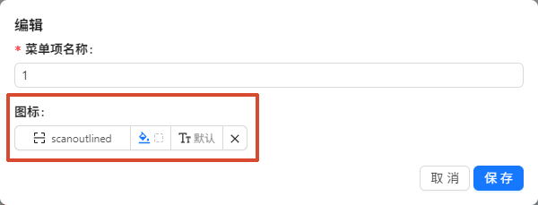

- **图标与标识直观呈现**：左侧清晰展示当前选中的图标形态与英文标识。
- **内置取色器**：点击调色板按钮可自由设置图标专属前景色。
- **字号快捷切换**：内置 `默认`、`小 (sm)`、`中 (md)`、`大 (lg)` 快捷字号微调，无需编写繁琐 CSS。
- **快捷清除**：提供一键重置清空按钮，操作简单轻量。

---

### 2. 现代面板：宽屏自适应选择器与智能子分类

点击图标输入框即可展开经过精心重构的图标选择浮层。浮层支持自适应宽屏排版，兼顾大量图标的高效选型与精确筛选：

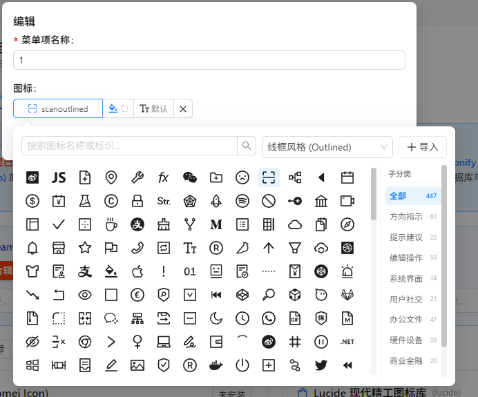

- **顶部快速检索栏**：支持按拼音、中文名称、英文标识进行毫秒级实时搜索过滤。
- **自适应宽屏布局**：根据视口宽度自适应延展（默认宽屏模式），图标展示更充裕、视线不局促。
- **右侧智能子分类标签**：基于精准分词规则，自动聚合如「通用」、「方向」、「媒体」、「办公文档」等子分类，并实时展示匹配图标数量，点击标签快速联动过滤定位。
- **快速导入入口**：右上角常驻「+ 导入」按钮，方便在选择过程中随时录入新图标。

---

### 3. 多维分类体系：官方内置与外部扩展库无缝整合

分类下拉菜单清晰划分为原生系统风格与外部/用户扩展图标库两大维度：

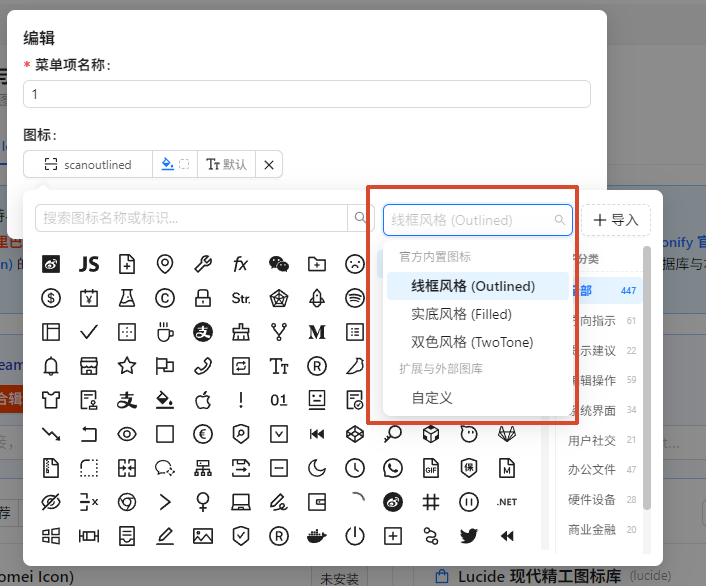

- **官方内置风格**：保留并分类归纳 Ant Design 官方线框风格、实底风格、双色风格。
- **扩展与外部图库**：动态追加用户自定义图标库以及各导入图库（如阿里官方图标、草莓图标、外部项目合辑等）。

---

### 4. 录入模式：单个 SVG 自定义导入与代码清洗

当您拥有个性化专属图标或品牌 Logo 时，可直接通过录入弹窗快速添加：

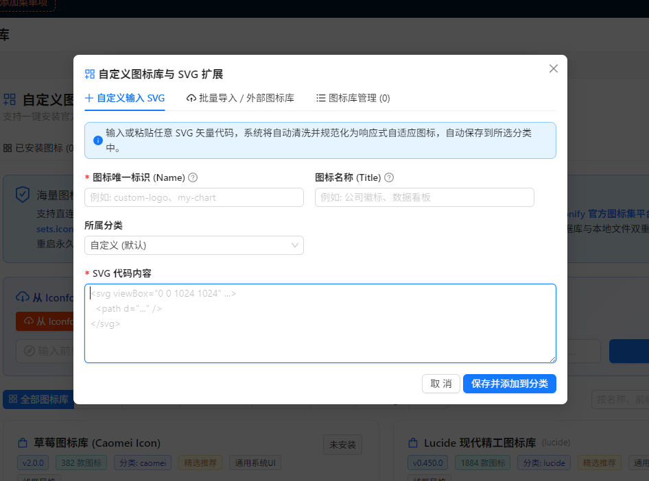

- **智能清洗优化**：自动剥离 `<svg>` 标签中写死的 `width`、`height` 与固定配色，统一替换为 `1em` 和 `currentColor`，确保与系统主题风格一致。
- **元数据定制**：支持指定英文唯一标识、中文显示标题及归属分类。
- **多维度实时预览**：右侧实时呈现 16px、24px、32px 多规格渲染效果及色彩变化。

---

### 5. 高效导入：多源批量导入与本地拖拽上传

针对大量图标资产的录入需求，插件提供了【批量导入 / 外部图标库】多合一选项卡：

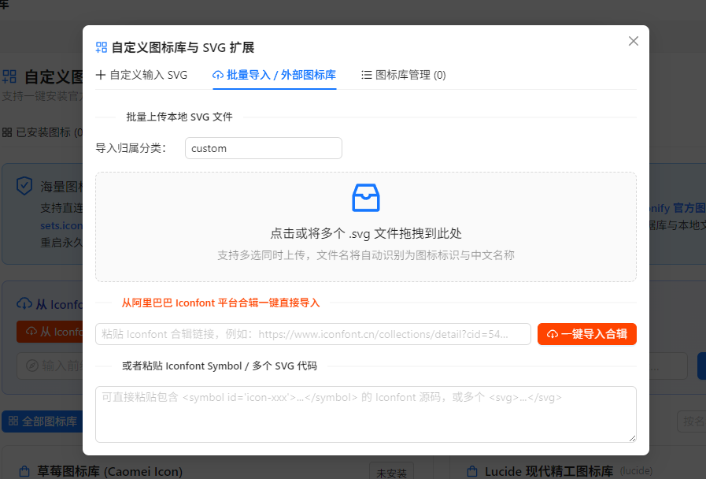

- **本地文件拖拽多选**：支持将多个 `.svg` 文件直接拖拽至上传区域完成秒级批量解析入库。
- **Iconfont 合辑链接一键抓取**：直接粘贴阿里巴巴矢量图标库项目链接，后台自动化探测并提取。
- **Symbol / 多 SVG 源码解析**：支持粘贴完整的 `<svg><symbol>...</symbol></svg>` 源码集，自动拆分并批量录入。

---

### 6. 生态聚合：Icon 仓库管理市场与卡片直观预览

在系统设置中心（**插件管理 -> 自定义图标设置 -> Icon 仓库管理**），汇聚了全球主流开源图标生态与预置高品质图库：

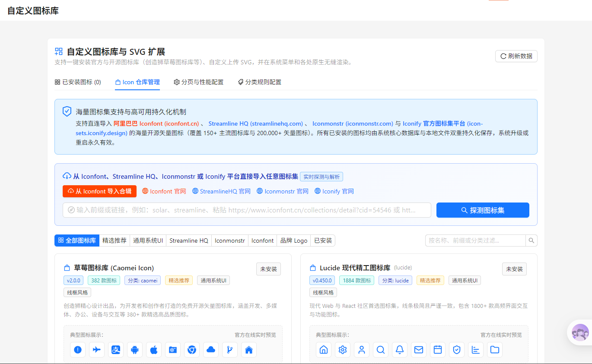

- **主流设计平台直达**：顶部聚合阿里巴巴 Iconfont、字节跳动 IconPark、Remix Icon、FontAwesome 等各大图标平台快速入口。
- **卡片式精选预览**：每张图库卡片精选展示前 **10 款代表性图标**，图库风格与质感一目了然。
- **分类标签快速过滤**：支持按「全部」、「精选推荐」、「扁平单色」、「品牌Logo」等多维度筛选图库。

---

### 7. 深度整合：阿里巴巴 Iconfont 在线合辑一键探测与入库

插件深度打通了国内最大的矢量图标平台——阿里巴巴 Iconfont（矢量图标库）。只需简单几步即可将网页上的公开合辑整库导入：

#### 步骤一：提取公开合辑网址
在浏览器中打开任意公开图标合辑网页，复制地址栏 URL（例如形如 `https://www.iconfont.cn/collections/detail?cid=...` 的链接）：

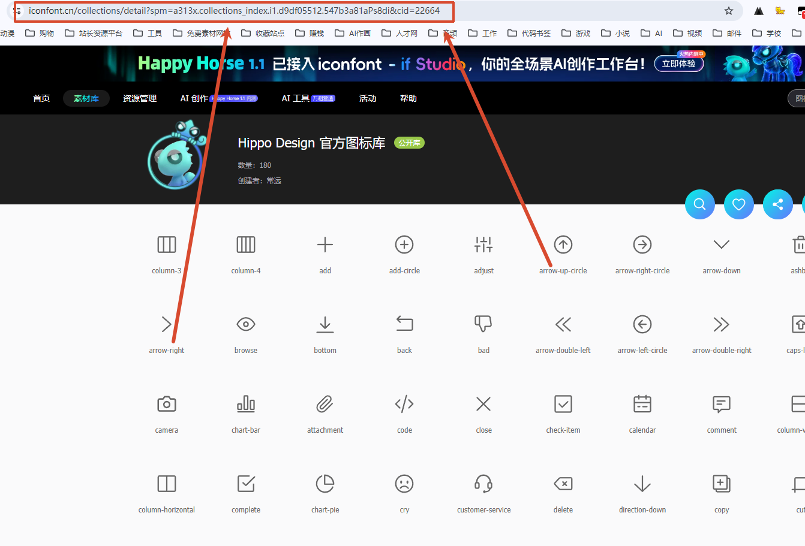

#### 步骤二：粘贴链接并在线智能探测
将链接粘贴至仓库管理顶部的探测框，点击「在线探测解析」：

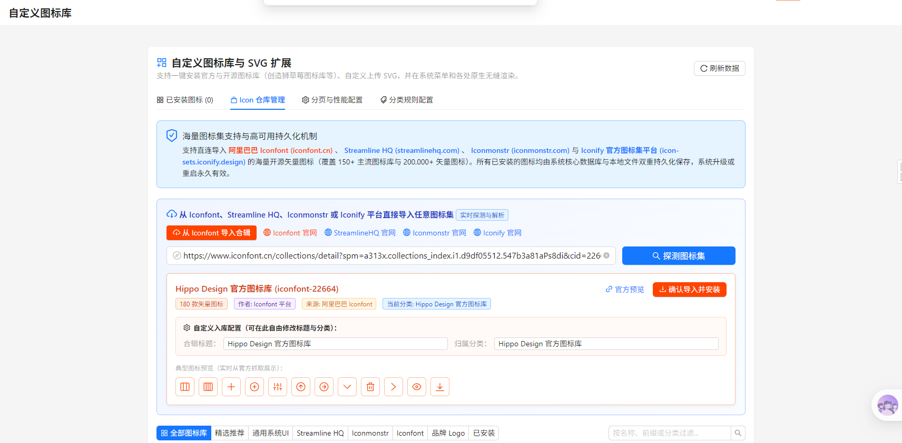

- **自动提取元信息**：系统自动解析出合辑标题、图标总数与作者信息。
- **灵活配置定制**：支持手动自定义图库显示名称、选择图库归属分类。
- **代表图标实时预览**：浮层中实时加载并展示合辑内精选图标，确认无误后点击「立即入库」即可完成快速导入。

---

### 8. 生命周期：图库卡片状态与安全卸载

导入成功后，图库卡片状态动态更新，提供全流程生命周期支持：

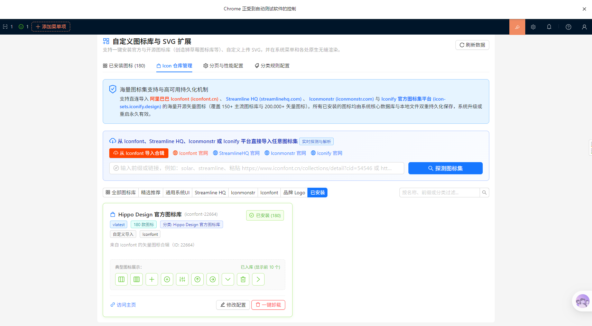

- **「已安装」状态标记**：直观展示已成功入库的前 10 款图标，标识库内总图标量。
- **修改配置**：支持二次调整图库名称与归属分类。
- **访问主页**：一键快速跳转至源项目网址。
- **一键安全卸载**：支持级联卸载，卸载时精准清理该图库下的关联图标资产，内置防误删保护，不影响其他图库及独立图标。

---

### 9. 资产中心：已安装图标表格化管理

在设置中心【已安装图标】选项卡中，提供全量图标的高效管理视图：

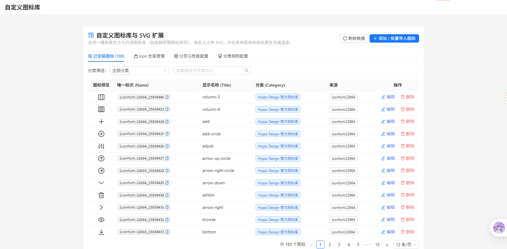

- **图标清晰预览**：大图标展示，渲染效果清晰直观。
- **系统标识一键复制**：提供标识复制快捷图标，方便在开发代码或表达式中引用。
- **彩色分类徽章与来源标记**：清晰区分归属分类及来源（如自定义、Iconfont 合辑等）。
- **便捷维护**：支持按分类及关键字快速检索，支持单项编辑与删除。

---

### 10. 生产实践：无缝热加载与菜单/表单实战体验

导入新图库后，无需刷新页面或重启服务，全局动态生效：

| 分类菜单即刻呈现新图库 | 实际业务场景应用（如菜单项配置） |
| :---: | :---: |
| 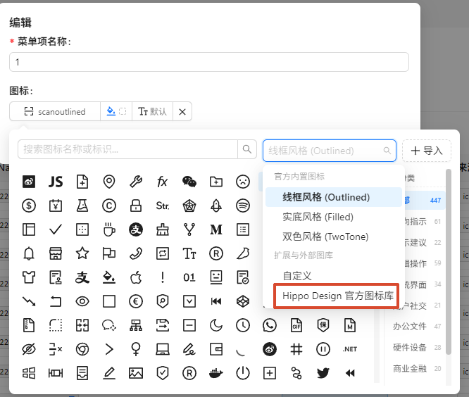 | 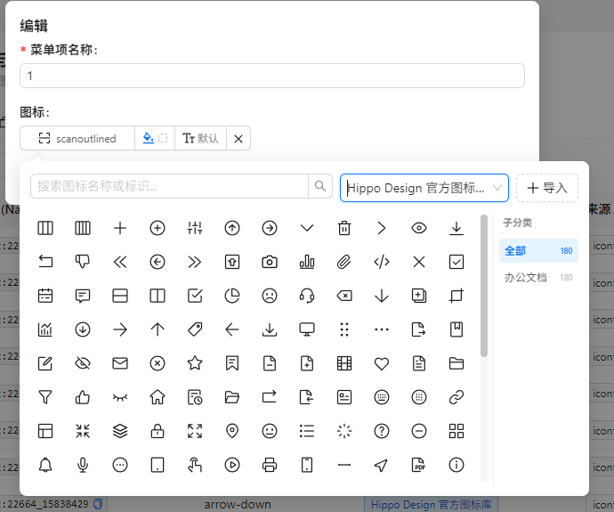 |

- **全端动态感知**：分类下拉菜单中即刻出现新入库图库项（如「Hippo Design 官方图标库」）。
- **精准子分类导航**：展开后左侧展示丰富图标，右侧子分类标签精准聚类（如「办公文档 180」），即点即选，选后即时在应用中高保真渲染！

---

## 🚀 安装与部署指南

### 方式 1：源码环境编译与启用
在 NocoBase 根目录下执行：

```bash
# 构建插件
yarn nocobase build @nocobase/plugin-custom-icons

# 激活并启用插件
yarn pm enable @nocobase/plugin-custom-icons
```

### 方式 2：使用官方打包产物 (.tgz) 导入
在生产环境或离线环境中，可直接通过官方命令行或插件管理器导入部署包：

```bash
# 通过官方命令行导入插件包
yarn nocobase plugin import storage/tar/@nocobase/plugin-custom-icons-0.1.4.tgz

# 激活并启用插件
yarn pm enable @nocobase/plugin-custom-icons
```

*注：亦可将压缩包直接解压至系统的 `./storage/plugins/@nocobase/plugin-custom-icons` 目录下。*

---

## 📦 官方标准打包构建

本插件完全遵循 [NocoBase 官方插件构建规范](https://docs.nocobase.com/cn/plugin-development/build)。

在项目根目录下执行以下命令即可生成官方标准插件发布包：

```bash
# 方案 A：一步构建并打包生成 .tgz 发布包
yarn nocobase build @nocobase/plugin-custom-icons --tar

# 方案 B：对已构建插件独立生成 .tgz 归档
yarn nocobase tar @nocobase/plugin-custom-icons
```

打包成功后，发布归档文件将自动输出至：  
📁 `storage/tar/@nocobase/plugin-custom-icons-0.1.4.tgz`

---

## ⚙️ 架构与技术细节

1. **双重持久化机制**：所有自定义图标与图库配置同时持久化至 NocoBase 核心数据库与本地资产目录，系统升级、容器重启、数据库备份均能保证数据完整无虞。
2. **底层安全防护**：对所有 SVG 源码进行 XSS 危险标签与脚本属性清洗过滤，确保企业级运行时环境安全。
3. **分批批处理与查询优化**：内置 SQLite / MySQL / PostgreSQL 多数据库优化适配，在大规模批量导入与卸载清理时自动进行分块批处理，杜绝底层 SQL 表达式深度超限问题。
4. **性能极致体验**：图标选择器采用虚拟滚动/流式网格渲染与按需加载技术，即使单个图库包含数千款图标，也能保持丝滑流畅。

---

## 📄 开源许可

本项目遵循 [AGPL-3.0 License](LICENSE)。
